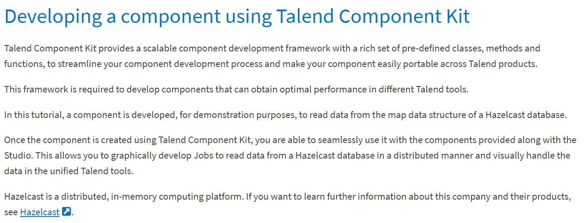
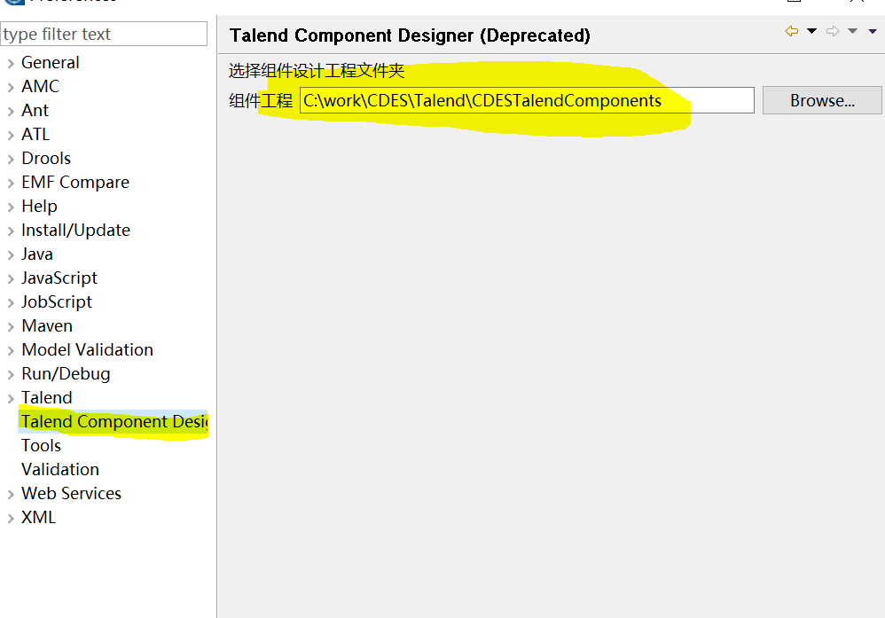
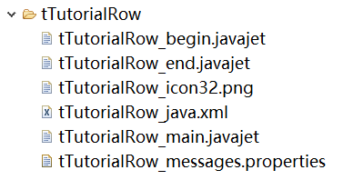
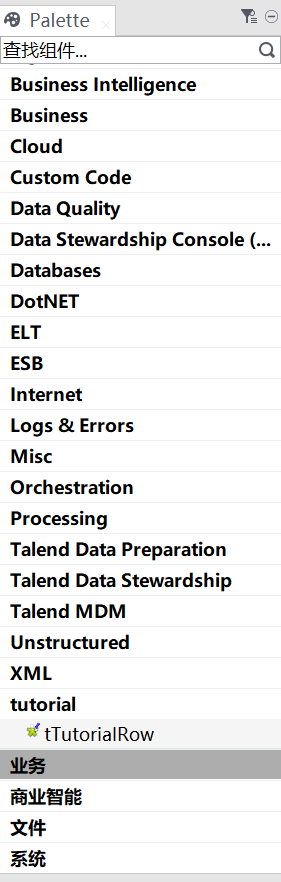
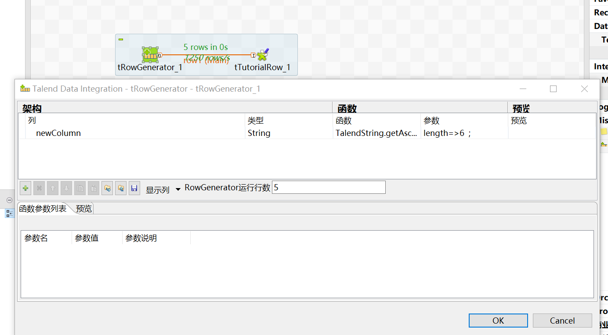
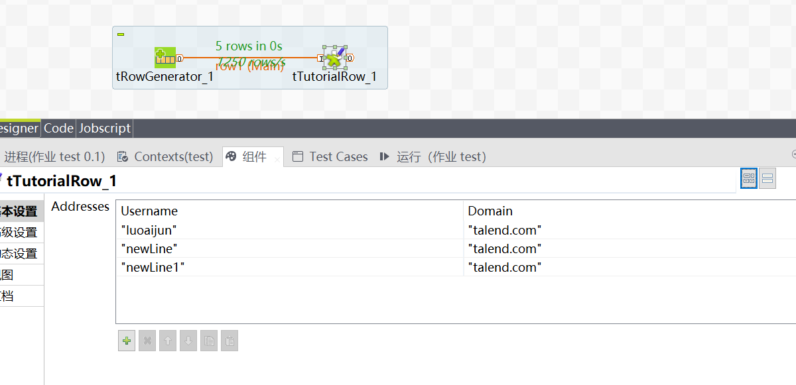
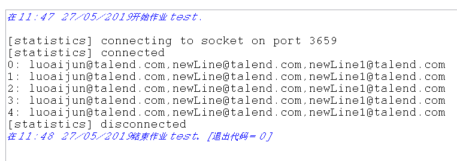

**How to design your component?**

---

##### INFORMATION :
###### Download it 
- 链接：[URL](https://pan.baidu.com/s/1vZmWZ2xyck7375hHDmzVmA) 
- 提取码：fkpc 

###### Useful information：
- [a guide that helps you create a custom component.](http://www.powerupbi.com/talend/componentCreation_index.html)

- [a video showing how to create a custom component using the Component Designer perspective](http://bekwam.blogspot.fr/2011/03/tutorial-component-designer-in-talend.html).

- [an example of tJava that helps you understand the way Talend components are built](http://www.talendbyexample.com/talend-custom-component-analysis.html).


###### where is it?

```
You can only use component designer in Talend Open Studio for Data Integration (DI).
```

###### Where is zhe difference ? 

```
In the early days ,you could  use it in any talend open sudio .
But now you can only use Desiger in Talend Data Integration version 6.x， 
Because after 7.x, talend provides Component Kit as a new component development toolkit.
Component designer and Component kit ?
```
###### This is what the official website says.
- Kit say:

- Kit say:



---

##### How to use it?
If you want to use version 6.x ,[Come here](https://www.talendbyexample.com/talend-custom-component-writing.html), please.
- version 7.x : [here](https://help.talend.com/reader/C0dGRfXr_xwP1vm8wG62BA/SGxjYVOKBZwp~ENBEWS50g)
- version 6.x : [here](https://help.talend.com/reader/QDC7DnW3S_chYXXornFuGw/3QRqVgh0vXKx3BPeUidHZw)

---

##### A Example for version 6.x:
###### Basic setting:
- Eiting component setting:(Window-Proferences-Talend-component)

- Eiting component setting:(Window-Proferences-component designer)


###### Step 1 :Creating the component folder and the required files
1. Create a folder named tTutorialRow on your file system.
2. Create the following five empty files in the newly created folder:

```
tTutorialRow_java.xml
tTutorialRow_messages.properties
tTutorialRow_begin.javajet
tTutorialRow_main.javajet
tTutorialRow_end.javajet
```
3. Create an icon file named tTutorialRow_icon32.png with the size of 32*32 in the tTutorialRow folder.


###### Step 2 :Editing the XML descriptor file
1. Open the XML descriptor file tTutorialRow_java.xml.
2. Edit the content of tTutorialRow_java.xml as below:


```
<COMPONENT>
  <HEADER
    PLATEFORM="ALL"
    SERIAL=""
    VERSION="2.0"
    STATUS="ALPHA"
  
    COMPATIBILITY="ALL"
    AUTHOR="Component Author"
    RELEASE_DATE="20070525A"
    STARTABLE="false"
  >
    <SIGNATURE/>
  </HEADER>
  
  <FAMILIES>
    <FAMILY>tutorial</FAMILY>
  </FAMILIES>
  
  <DOCUMENTATION>
    <URL/>
  </DOCUMENTATION>
  
  <CONNECTORS>
    <CONNECTOR CTYPE="FLOW" MAX_INPUT="1"/>
    <CONNECTOR CTYPE="ITERATE" MAX_OUTPUT="1" MAX_INPUT="1"/>
    <CONNECTOR CTYPE="SUBJOB_OK" MAX_INPUT="1" />
    <CONNECTOR CTYPE="SUBJOB_ERROR" MAX_INPUT="1" />
    <CONNECTOR CTYPE="COMPONENT_OK" />
    <CONNECTOR CTYPE="COMPONENT_ERROR" />
    <CONNECTOR CTYPE="RUN_IF" />
  </CONNECTORS>
  
  <PARAMETERS>
    <PARAMETER NAME="ADDRESSES" FIELD="TABLE" REQUIRED="true" NUM_ROW="3" NB_LINES="5" SHOW="true">
      <ITEMS BASED_ON_SCHEMA="false">
        <ITEM NAME="USERNAME" />
        <ITEM NAME="DOMAIN" />
      </ITEMS>
    </PARAMETER>
  </PARAMETERS>
  
  <CODEGENERATION/>
  
  <RETURNS>
    <RETURN NAME="NB_LINE" TYPE="id_Integer" AVAILABILITY="AFTER"/>
  </RETURNS>
  
</COMPONENT>
```
- As described in this descriptor file:

```
The component family is "tutorial".
The component has a parameter named "ADDRESSES" of the TABLE type.
The parameter has two items (which correspond to columns), "USERNAME" and "DOMAIN".
The component returns a NB_LINE global variable.
```


###### Step 3 :Editing the message properties file

1. Open the message properties file tTutorialRow_messages.properties in a text file editor.
2. Edit the default label for each of the variables declared in the XML descriptor file.


```
LONG_NAME=Tutorial component
HELP=org.talend.help.TutorialRow
 
NB_LINE.NAME=Number of line
ADDRESSES.ITEM.USERNAME=Username
ADDRESSES.ITEM.DOMAIN=Domain
ADDRESSES.NAME=Addresses
```

- According to the parameters settings in the XML descriptor file and the labels in the message properties file, the component settings in the Studio will look like the following:


###### Step 4 :Editing the java template files
1. Open tTutorialRow_begin.javajet in a text file editor and define the beginning of the component javejet code as follows:

```
<%@ jet
    imports="
        org.talend.core.model.process.INode
        org.talend.core.model.process.ElementParameterParser
        org.talend.core.model.metadata.IMetadataTable
        org.talend.core.model.metadata.IMetadataColumn
        org.talend.core.model.process.IConnection
        org.talend.core.model.process.IConnectionCategory
        org.talend.designer.codegen.config.CodeGeneratorArgument
        org.talend.core.model.metadata.types.JavaTypesManager
        org.talend.core.model.metadata.types.JavaType
        java.util.List
        java.util.Map      
    "
%>
<%
    CodeGeneratorArgument codeGenArgument = (CodeGeneratorArgument) argument;
    INode node = (INode)codeGenArgument.getArgument();
    String cid = node.getUniqueName(); 
    List<Map<String, String>> lines = (List<Map<String,String>>)ElementParameterParser.getObjectValue(node, "__ADDRESSES__");
%>
java.util.List<String> addresses_<%=cid %> = new java.util.ArrayList<String>();
<%
  for (int i=0; i<lines.size(); i++) {
    Map<String, String> line = lines.get(i);
%>
    addresses_<%=cid %>.add(<%= line.get("USERNAME") %> + "@" + <%= line.get("DOMAIN") %>);
<%
  }
%>
int nb_line_<%=cid %> = 0;
```
This javajet file defines three variables:


```
lines, of type List, to store all the rows of the table filled in by the user.
addresses_<%=cid %>, of type List, to store the concatenations of the USERNAME column and the DOMAIN column.
nb_line, to populate the number of lines processed by the tTutorialRow component.
```


2. Open tTutorialRow_main.javajet in a text file editor and define the main part of the component javejet code as follows:

```
<%@ jet
    imports="
        org.talend.core.model.process.INode
        org.talend.core.model.process.ElementParameterParser
        org.talend.core.model.metadata.IMetadataTable
        org.talend.core.model.metadata.IMetadataColumn
        org.talend.core.model.process.IConnection
        org.talend.core.model.process.IConnectionCategory
        org.talend.designer.codegen.config.CodeGeneratorArgument
        org.talend.core.model.metadata.types.JavaTypesManager
        org.talend.core.model.metadata.types.JavaType
        java.util.List
        java.util.Map      
    "
%>
<%
    CodeGeneratorArgument codeGenArgument = (CodeGeneratorArgument) argument;
    INode node = (INode)codeGenArgument.getArgument();
    String cid = node.getUniqueName(); 
%>
    String[] adresses_<%=cid %> = addresses_<%=cid %>.toArray(new String[] {});
     
    System.out.print(nb_line_<%=cid %>++ + ": ");
    for (int i_<%=cid %> = 0; i_<%=cid %> < adresses_<%=cid %>.length; i_<%=cid %>++ )
    {
      System.out.print(adresses_<%=cid %>[i_<%=cid %>]);
      if (i_<%=cid %> < adresses_<%=cid %>.length-1) System.out.print(",");
    }  
    System.out.println();
```
- As described in the article [Component code generation model](https://help.talend.com/reader/l7NhyWCKP6jWnDHnMHdhhQ/G7Pi3vQO1~eYzhuWoKT3Xg), the main part of the Java code will be executed at each line of the incoming data flow. It will print the line number and the list of email addresses to the console.

3. Open tTutorialRow_end.javajet in a text file editor and edit the end of the component javejet code as follows:


```
<%@ jet
    imports="
        org.talend.core.model.process.INode
        org.talend.core.model.process.ElementParameterParser
        org.talend.core.model.metadata.IMetadataTable
        org.talend.core.model.metadata.IMetadataColumn
        org.talend.core.model.process.IConnection
        org.talend.core.model.process.IConnectionCategory
        org.talend.designer.codegen.config.CodeGeneratorArgument
        org.talend.core.model.metadata.types.JavaTypesManager
        org.talend.core.model.metadata.types.JavaType
        java.util.List
        java.util.Map      
    "
%>
<%
    CodeGeneratorArgument codeGenArgument = (CodeGeneratorArgument) argument;
    INode node = (INode)codeGenArgument.getArgument();
    String cid = node.getUniqueName(); 
%>  
    globalMap.put("<%=cid %>_NB_LINE",nb_line_<%=cid %>);
```
- In this example, the nb_line variable is put in a globalMap so that it can be reused in the Job. The suffix of the key is NB_LINE, which is the variable name declared at the end of the XML descriptor file tTutorialRow_java.xml.

###### Step 5 :Installing and testing the created component
- right-click Component ， Push components To Palette ，then you can find it.





- use it
1. Check that the component works in a Talend Job.
- As an example, create a simple Job that contains a tRowGenerator and a tTutorialRow, and configure the components as follows:

**- tRowGenerator**





**- tTutorialRow**





- Configure the tRowGenerator to generate five lines of random strings.
- Specify the user names and domain names to construct email addresses in the Addresses table of tTutorialRow component.
- When the Job is executed, the tTutorialRow is expected to print the current line number and the list of email addresses in the Job console.
- 

